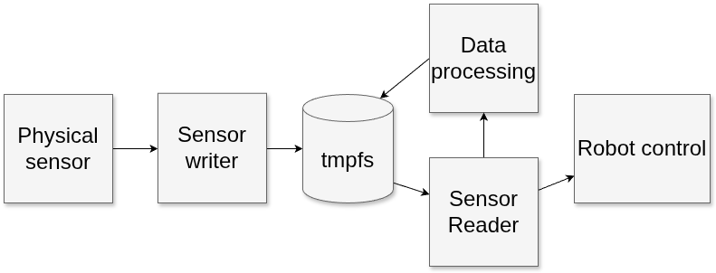

<!--- https://joss.readthedocs.io/en/latest/example_paper.html
and  https://joss.readthedocs.io/en/latest/paper.html  --->

# Summary

Robotic systems must perform diverse tasks such as sensing, planning, and actuation. Implementing all these functions within a single monolithic program leads to complexity and hinders future development. A modular approach — where each subsystem communicates via interprocess communication (IPC) — improves maintainability and flexibility.

The tmpfs framework is a simple IPC solution for Linux. It uses temporary files in memory (tmpfs) to share data between programs and data is stored in files with clear names. The Concise Binary Object Representation (CBOR) serves as a serialization protocol optimized for efficient handling of binary data. This methodology accommodates complex data structures, including arrays and images, rendering it highly adaptable for diverse applications. The associated framework is lightweight, ensuring seamless deployment and operation across the majority of Linux-based systems. A key advantage of this approach is the straightforward integration of additional sensors or actuators, made possible by its flexible message architecture.

**Principal Advantages**

-	Ease of Setup: The framework allows for rapid deployment, thereby minimizing initial configuration efforts.
-	Portability: Its compatibility with a wide range of Linux platforms increases its versatility in varied operational environments.
-	Self-Describing Data: Data structures are inherently self-documenting, which facilitates interpretation and integration.
-	“Publish and Forget” Communication: The framework supports a communications model wherein data can be published without the need for ongoing management or supervision.

**Context of Application**

Although the framework may not be optimal for stringent real-time applications, its implementation of tmpfs-based inter-process communication (IPC) demonstrates robust performance in scenarios where modularity, transparency, and ease of integration are paramount. Notably, this framework has been effectively employed in some research initiatives [@Mäenpää:2025;@Ariram:2024]

# Statement of Need

Robotic systems need to perform several interconnected tasks to function in real environments. These tasks include perception of environment using different sensors, planning actions, and controlling actuators to execute these actions. Each of these tasks can be further divided into subtasks, some of which can operate independently of other tasks, some requiring other tasks to be performed. For example, planning a safe and effective route for an autonomous robot requires information of robot’s surroundings so sensors need to be collecting information for the planning system.

A single program that performs all these tasks would lead to large and complex codebase and can lead to inflexibilities in the system when some parts need to be modified. It is often beneficial to divide the robotic system to smaller subsystems. These systems have to share information with each other, thus need for an inter-process communication solution.

Interprocess communication allows exchanging information between programs running on same computer. It allows creating non monolithic systems that consist of several separate programs each performing a specific task. When the system consists of multiple small programs, each program can be developed separately making the system more maintainable and flexible.

# The tmpfs framework
{ width=88% }

The tmpfs-framework is a lightweight IPC solution for Linux robotics. It uses the tmpfs in-memory file system, allowing processes to exchange data quickly by reading and writing files in RAM. Each file is clearly named and organized, making it easy to add or modify sensors and actuators without rigid message formats. Data read from a physical sensor is saved on the tmpfs, where it can be read and refined for further use as illustrated in \autoref{fig:tmpfs_dataflow}.

Data is serialized using CBOR, which provides compact, binary encoding and supports complex data types like arrays and images. This enables schema-free, efficient communication between components.
The framework ensures data integrity with atomic file operations: data is written to a temporary file and then atomically renamed, so readers never see incomplete data. Linux manages file lifetimes, preventing deletion while files are in use.
With minimal dependencies and POSIX compliance, the framework is portable across Linux systems and easy to deploy. It is best suited for research and development scenarios where modularity and rapid integration are priorities, though it is not intended for hard real-time applications.

The tmpfs-framework requires only few libraries, most of which are installed by default in many popular Linux distributions. The framework can easily be deployed in most computers running modern Linux. It is a useful tool in robotics research allowing fast integration of new sensors and actuators to measure their performance in robotic tasks. Because of its portability, device interfaces can be developed on desktop computers and later deployed in computers controlling robots. Because system is self-describing and does not require predefined messages or data-types users free to use data from the sensors as it is and not forced to lose information forcing the data to old message types.

# State of the field:

There exists several robotics middleware's with IPC implementation. Probably best know of them is ROS2, which by default handles ICP using Data Distribution Service (DDS) based on network stack. Messages are predefined by message files, only extendible by encapsulation. It is also possible to use different middleware for message passing most notable Zenoh that allows avoiding some of the issues of DDS’s. [@ROS;@Puck:2021]

ROS2 has significant drawbacks, including heavy dependencies and poor interoperability between versions, which complicates development on platforms like NVIDIA Jetson that often use older ROS2 releases due to compatibility issues with custom Linux distributions. DDS, the default communication middleware, can be problematic, misconfiguration may crash the network and requires expert tuning, making ROS2 less appealing for research. Additionally, reliance on predefined message types can lead to data loss or reduced accuracy, especially for sensors like low-cost LiDARs with variable rotation speeds, forcing developers to either accept inaccuracies or modify any used messages partly negating advantages of existing library of predefined messages.

Other notable robotics middlewares include Mira [@Einhorn:2012] used mostly by Ilmenau University of Technology; KoGMo-RTDB [@Goebl:2007] successfully used in creation of popular KITTI dataset and MuCar; YARP(Yet Another Robot Platform) [@Metta:2006] included in iCub robot. These middlewares are complex and their documentation is at least partly incomplete with broken links or TODOs. Seemingly steep learning curve is os possible cause that limits adaptation of these middlewares. Learning to use the tools is time away from actual research so for researchers simple and well documented middlewares would be preferable.

# Acknowledgements

# Use of AI
Generative AI was used to improve PEP8 compliance of the code and to generate initial docstrings. Changes made by AI were verified to not have any effect on functionality of the code. Initial version of unit tests were generated with generative AI, but were later reworked manually. Generative AI was used during paper writing for initial drafting, rewritten later by human, and later to improve grammar.

# References
