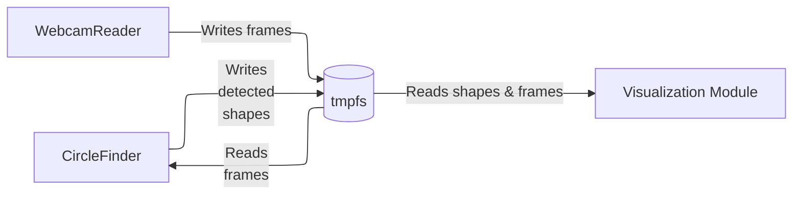

# Webcam and Shape Detection

The example contains three Python modules that work together to capture webcam images, detect shapes (specifically circles), and visualize the results. The modules leverage **OpenCV**, threading. Showing how `tmpfs_framework` can be used for temporary storage and inter-process communication.

### Dataflow:

Images are captured from webcam stream, written in tmpfs. Images in tmpfs are read and processed to detect circles. Unprocessed image and detected shapes are combined in separate process.

## Purpose
1. Example with sensor that is easy to acquire and give a starting point for adding new types of sensors.
2. Give idea of latency in tmpfs-framework
   - Images are written to tmpfs and later read from there for shape detection this causes delay that can be seen by moving detected objects or webcam
3. Demonstrates idea of having data processing module that generates new data from existing.
    - This allows implementing a whiteboard system where some processes provide raw data and other processes process the data to generate additional information


## Extra Dependencies
- OpenCV (`cv2`)

---

## 1. WebcamReader Module
**Purpose:** Captures frames from a webcam device and writes them to a temporary filesystem using the `SensorWriter` class from `tmpfs_framework`.

### Key Components
- **Class:** `WebcamReader(SensorWriter)`
  - Captures frames using OpenCV and writes them to tmpfs.
  - Supports optional frame rate limiting.

### Starting
```bash
python webcam_reader.py [device_index] [maximum_framerate]
```

---

## 2. CircleFinder Module
**Purpose:** Reads images from the webcam sensor and detects circular shapes using Hough Transform. Detected shapes are stored and visualized.

### Key Components
- **Class:** `CircleFinder(SensorWriter)`
  - Detects circles using `cv.HoughCircles`.
  - Writes detected shapes and greyscale images to tmpfs.
  - Packs detected shapes into a ZIP archive using `pack_to_zip`.

### Starting
```bash
python circle_finder.py
```

---

## 3. Visualization Module
**Purpose:** Displays the original webcam feed and overlays detected shapes from the `CircleFinder` module.

### Key Components
- Reads webcam frames and shape data using `SensorReader`.
- Overlays detected circles on the original image using OpenCV.

### Starting
```bash
python visualisation.py
```

---

---

## Workflow
1. Start **WebcamReader** to capture frames.
2. Start **CircleFinder** to process frames and detect shapes.
3. Run **Visualization Module** to display results in real-time.

WebcamReader has to be started before starting Circle finder or visualisation module. After it has been started Circle finder and visualisation module can be started in any order. It's also possible to stop any of the modules after starting other modules should stay running even if they don't get new data from the other modules.
